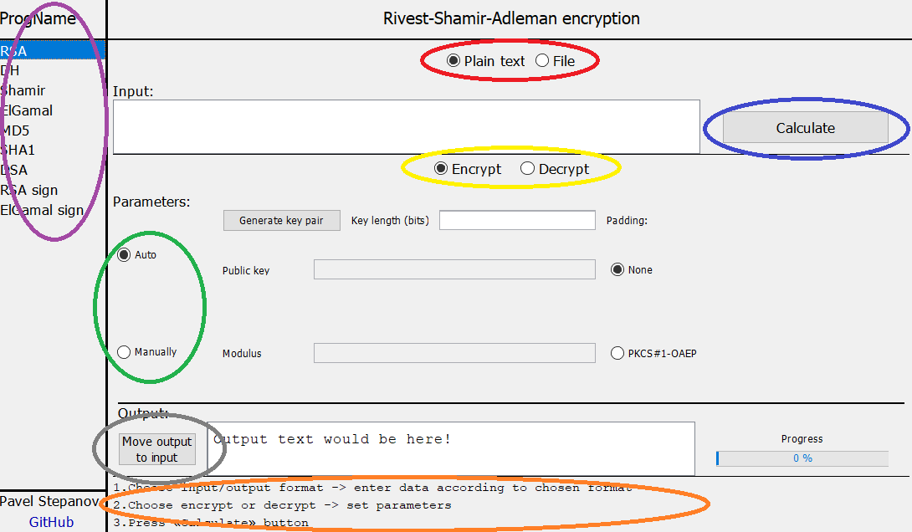

# Main panels

- RED - user input type;
- YELLOW - type of operation happens after click on "Calculate" button;
- BLUE - Button for Encryption/Decryption. Used after entering all parameters (if necessary);
- GREEN - parameters auto generation or manual user specification. According to selected type - disable corresponding buttons/fields;
- PURPLE - list of all able algorithms;
- GREY - button to move calculated output to input (if "plain text" input type used). In some algorithms move output to parameter field(s);
- ORANGE - log field. There writes every happened exceptions and spent time of calculations.
## Order of actions
1) Select algorithm type in **PURPLE** panel
2) Select input type in **RED** panel and enter data (if necessary). If file selected - choose input and output files using corresponding buttons "Choose file"
3) Select encrypt or decrypt input data in **YELLOW** panel. In some algorithms used terms Alice/Bob or Sign/Verify
4) Specify/generate (according to **GREEN** panel) parameters
5) Press calculate button in **BLUE** panel
6) Get result from output field or file according to selected input type from step 2
7) (Optionally) View **ORANGE** panel to check time consumed for calculation or type of error (if it happens)
8) (Optionally) Use button from **GREY** panel to move result in input field to do some other operations/algorithms with calculated data